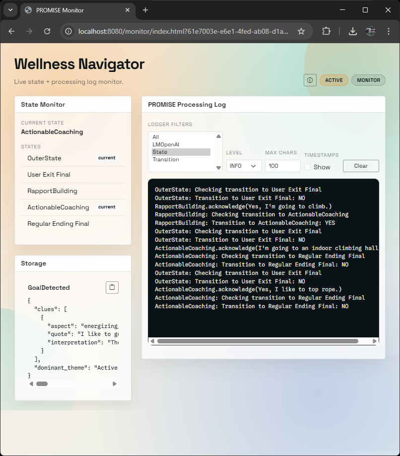

# PROMISE
An application development **framework** that supports the development of complex **language-based interactions** using **state machine modelling** concepts.

With PROMISE, language models can be used more effectively and efficiently, while their behaviour can be better controlled. This is achieved by enabling model-driven, dynamic prompt orchestration along hierarchically nested states, while incorporating conditions and actions associated with specific interaction segments.

**Note:** This is a public repository where we occasionally publish snapshot versions. Contact us if you seek access to our dev repository with additional features and application examples.

## Table of Contents
- [Why](#why)
- [What](#what)
- [How](#how-single-state-interaction)
- [Clients](#clients)
- [Code](#code-single-state-interaction)
- [Getting Started](#getting-started)
- [Stepping Up](#stepping-up-multi-state-interactions)
- [REST API](#rest-api-documentation)
- [Deploying to Heroku](#deployment-guide-deploying-to-heroku)


## Why
Since the advent of powerful language models, reinforced by their recent breakthrough, expectations for increasingly complex conversational interactions between humans and machines have grown rapidly. This emphasises the need to be able to investigate the feasibility and value of such interactions. However, while the capabilities of language models are making impressive progress, the ability to control their behaviour and consistency is lagging behind.

Training LMs from scratch to serve a specific purpose is resource-intensive and often impractical for typical development projects. Although fine-tuning can tailor LM responses, it demands meticulous data preparation, making fast, iterative experimentation difficult. In contrast, prompt engineering allows developers to bypass traditional pre-training and fine-tuning bottlenecks. However, the specification of a complex interaction entails complex prompts, which lack controllability and reliability. Ultimately, neither approach fully addresses the challenges arising when complex interactions should be developed, integrated with information systems, implemented in variants, and improved iteratively.

## What
We therefore propose PROMISE (Prompt-Orchestrating Model-driven Interaction State Engineering), an application development framework addressing the need for more support for the rapid design and implementation of complex conversational interactions. PROMISE bridges the gap between the requirements of such interactions and the use of language models to enable them. Framework support is based on a model that can capture a wide range of requirements and effectively control the use of LMs while leveraging their full capabilities.

PROMISE is built on the following core concepts, each playing a distinct role in supporting complex, model-driven conversational applications.

- **State Machine Architecture**  
  PROMISE uses state machines to structure conversations, with each state representing a point in the interaction flow. This structured approach enables seamless, rule-based transitions between sections of the conversation. Transitions between states are controlled by triggers, guards and actions, allowing for sophisticated conversation control and supporting dynamic adjustments in response to user input.
- **State and Transition Prompts**  
  Each state is coupled with a prompt that defines the role and tone of the language model in that part of the interaction. For example, a state prompt could position the model as a supportive therapy coach who ensures consistent responses. Another state preceding it could instruct the model to conduct small talk to provide a mindful setting before addressing the therapy. Transition prompts specify the conditions and responses required to move to the next state. This dual prompting system improves both the quality of responses and the contextual awareness of the language model.
- **Agent Abstraction**  
  The agent encapsulates the state machine and serves as the primary interface for programmatic interaction. It handles initialization and response generation and integrates with system components such as APIs. The agent pattern simplifies the use of PROMISE in a variety of contexts, from back-end service endpoints for UI-driven user sessions to integrations with VR environments.
- **Common States**  
  PROMISE contains predefined states for common scenarios, such as querying missing information or presenting multiple choices. These special states encapsulate reusable interaction logic, reducing development time and improving consistency between applications.
- **Nested State Machines (Outer States)**  
  PROMISE supports complex conversational workflows with outer states that manage overarching interaction goals while containing inner states for detailed conversations. This enables multi-layered, hierarchical interactions where high-level states pursue general goals and inner states handle specific questions or actions.
- **Interaction Storage**  
  A key-value storage system supports the retention of information across multiple states and enables the storage of user responses, query results or other contextual data for later use in the interaction flow. This persistent storage improves continuity and the user experience, as previous inputs can be referenced and used in future states.

## How (Single-State Interaction)
The following conversation is a daily check-in interaction with patients using a health information system. Such interactions aim to assess their well-being related to their chronic condition and therapy plan.

<p align="center">
 
</p>

With PROMISE, the following state machine is used to design and implement this interaction.

<p align="center">
 
</p>

The **state** is annotated with the **state prompt** "As a digital therapy coach, ..." which will be used to control the LM while the interaction is in that state. The outgoing **transition** that leads to the final node is annotated with prompts indicated by "Information provided", "No open issues", and "Summarise". These prompts control the LM when evaluating the conversation concerning transition **triggers**, **guards**, and **actions**. PROMISE transparently composes more complex prompts from such simple prompts attached to states and transitions.

This simple example application demonstrates one key feature of PROMISE's extended state model. While the state prompt is used to control the generation of responses to the user when the interaction is in a particular state, separate prompts are used to control the decision on whether the interaction should transition to another state, and the actions that should be executed upon transitioning. The use of prompts for such decisions and actions enables semantically comprehensive control of interaction flows, e.g. based on conversational content that manifests itself across multiple user utterances.

## Clients

PROMISE ships with two built-in browser clients:

### Text-Based Chat
- URL: `http://localhost:8080/?agentId=<agentUUID>` (example: `http://localhost:8080/?agentId=3f2b8c6a-4b5a-4b3f-a6f0-1d3e7c6d4e1a`)
- Minimal, text-focused chat UI for standard agent conversations.

<p align="center">
 
</p>

### Monitor
- URL: `http://localhost:8080/monitor/?agentId=<agentUUID>` (example: `http://localhost:8080/monitor/?agentId=3f2b8c6a-4b5a-4b3f-a6f0-1d3e7c6d4e1a`)
- Live state display (current state + all states) and PROMISE processing logs.

<p align="center">
 
</p>

For Python usage, see `PROMISE_Realtime.ipynb`. For the realtime client and integration details, see `REALTIMEDME.md`.

## Code (Single-State Interaction)
An interaction such as the one specified by the state model above is implemented by creating instances of the state model concepts **State** and **Transition**. A **State** is created as follows,

```java
State state = new State(
    "As a digital therapy coach, check in with your patient...",
    "Check-In Interaction",
    "...compose a single, very short message to initiate...",
    List.of(transition)
);
```

where the **Transition** provided as part of the list is created as follows.

```java
Storage storage = new Storage();
Decision trigger = new StaticDecision(
    "Review the conversation...decide if...patient provided..."
);
Decision guard = new StaticDecision(
    "Review the conversation...decide if...no open issues..."
);
Action action = new StaticExtractionAction(
    "Summarize the conversation, highlighting...",
    storage,
    "summary"
);
Transition transition = new Transition(
    List.of(trigger, guard),
    List.of(action),
    new Final()
);
```

Typically, an **Agent** wraps the state machine and provides the functions required to integrate the interaction with an information system, such as with a REST controller if PROMISE is used to serve a web application.

```java
Agent agent = new Agent(
    "Digital Companion",
    "Daily check-in conversation.",
    state
);
String conversationStarter = agent.start();
String response = agent.respond(
    "I am handling the fasting quite well."
);
```

## Getting Started

#### 1. Requirements
- Do you have a JDK?
    - Test with ***javac --version*** in your console.
    - If not, get it from https://dev.java/download/.
- Has the environment variable JAVA_HOME been set?
- Do you have MySQL?
    - Get the ***MySQL Community Server***.
    - Remember the database password you set (example: `mysecret`).
    - Optionally get ***MySQL Workbench*** to access the database directly.
- Using Visual Studio Code?
    - Get the ***Extension Pack for Java***.
    - Get the ***Spring Boot Extension Pack***.

#### 2. Set Up
- Create a database (example: `promise_dev`).
- In the project folder ***src/main/resources/***, ...
    - copy both properties templates, rename them (remove ***.template***).
    - ***application.properties***: set the database name in `spring.datasource.url` (example: `jdbc:mysql://localhost:3306/promise_dev`).
    - ***application.properties***: set the username in `spring.datasource.username` (example: `root`).
    - ***application.properties***: set the password in `spring.datasource.password` (example: `mysecret`).
    - ***openai.properties***: choose openai vs. azure openai and set API key.

***Definition of Done***:
If you can build it (e.g., Maven:statefulconversation:Plugins:spring-boot:run)

#### 3. Interaction
- Run an existing unit test in ***src/test/java/.../bots/*** (e.g., SingleStateInteraction)
- OR create your own unit test in ***src/test/java/.../.../***
    - Unit test creates Agent and saves it to Database
    - Run your own unit test
- Start the back-end (e.g., Maven:statefulconversation:Plugins:spring-boot:run)
- Find an agent ID: http://localhost:8080/agent (use the `id` field)
- Interact using: http://localhost:8080/?agentId=<agentUUID> (example: `http://localhost:8080/?agentId=3f2b8c6a-4b5a-4b3f-a6f0-1d3e7c6d4e1a`)

## Stepping Up: Multi-State Interactions

The following assistant-patient interaction is a highly simplified, minimal example of the need to achieve multiple goals in one conversational interaction. The interaction is triggered because the patient has not completed a therapy activity (swimming). The first goal of this interaction is to obtain the reason for the patient's failure (light gray), and the second goal is to make adjustments to the therapy activity to increase the patient's adherence (dark gray).

<p align="center">
 
</p>

The following state machine models this interaction.

<p align="center">
 
</p>

This state machine includes three novelties compared to the single-state interaction presented above.
1. Multiple states follow up on each other to implement a **conversational flow**
2. **Special-purpose states** with predefined conversational behaviours are involved
3. There is an **outer state** containing a sequence of inner states

#### Conversational Flows
The ability to create sequences of states follows from the ability to create transitions. In this example, the interaction begins with a state in which the patient's reasons for missing the swimming activity are asked. If the patient provides a sufficient reason, the interaction transitions to the next state where options are offered. As soon as the patient has chosen one of these options, the interaction moves on to the final node.

In general, each state can have any number of outgoing transitions. Each transition is triggered and guarded by its own decisions, is accompanied by its own actions, and refers to any other state. Consequently, PROMISE supports the creation of arbitrary directed and possibly cyclic graphs of interaction flows.

#### Special-Purpose States
PROMISE contains a library of special-purpose states that address recurring requirements. For example, a state for querying activity gaps assesses the patient's reasons for missing an activity. To instantiate, the developers simply specify the missed activity. Similarly, a single-choice state accepts a list of choices to be made available to the patient, one of which the patient should select. Such states encapsulate predefined prompts and transitions, effectively reducing the development effort. This library also includes states, choices and actions that support retrieval augmented generation, e.g. for querying documents, databases or other knowledge bases and merging query results into state and transition prompts.

#### Outer States
PROMISE is able to support nested conversations by specifying state machines that can behave at different levels - seemingly simultaneously. In our example, at any stage of the inner interaction, the patient can indicate that they want to end the interaction. In PROMISE, an outer state tracks the entire conversation in all inner states, as it maintains its own utterances for all inner states. Therefore, each transition associated with an outer state responds to a larger interaction segment when decisions are made, or actions are taken. 

Moreover, if an outer state has its own state prompt, this prompt is automatically appended to the state prompts of all its internal states. In this example, the role prompt "As a digital therapy coach, ..." is attached to the outer state and therefore does not need to be repeated in all inner states. This allows developers to specify partial conversational behaviours that affect more extensive segments, such as the use of persuasion strategies.

#### Interaction Storage
PROMISE provides a simple key-value based storage that can be assigned to a state machine (agent). Such a storage can be accessed by any state or transition to store or retrieve values throughout the interaction. States, transition decisions and transition actions are instantiated with the keys they use at the time of the interaction to retrieve and inject information into their prompts or to store information and make it available for subsequent states, decisions, or actions.

This storage can also be used to bring information from other system components into an interaction. For example, if the reason for a patient's failure to complete a therapy activity has been identified and a knowledge base has been accessed to find an adjustment to the activity, this adjustment would be put into the storage. The interaction can then pick it up from there and bring it into a conversation with the patient. Alternatively, this storage can also be used to provide information from the conversation to other system components, e.g. a summary of a daily check-in interaction to be passed to the patient information system used by the clinician.

## REST API Documentation

The PROMISE framework provides a REST API for managing and interacting with agents. The API is divided into two main sections: interacting with existing agents and creating new agents.

#### Endpoints for Existing Agents

These endpoints allow you to interact with an existing agent using its unique identifier (`agentID`). All endpoints are defined in the `AgentController` class.
Base URL: `http://localhost:8080`
Example `agentID`: `3f2b8c6a-4b5a-4b3f-a6f0-1d3e7c6d4e1a`

- **GET** `/{agentID}/info`  
  Retrieves basic information about the agent.
  - **Response**: `AgentInfoView`
    - `id`: UUID of the agent
    - `name`: Name of the agent
    - `description`: Description of the agent
    - `active`: Boolean indicating if the agent session is active
  - **Example**: `GET http://localhost:8080/3f2b8c6a-4b5a-4b3f-a6f0-1d3e7c6d4e1a/info`

- **GET** `/{agentID}/conversation`  
  Retrieves the conversation history with the agent.
  - **Response**: `List<Utterance>` representing the conversation history.

- **GET** `/{agentID}/state`  
  Retrieves the current state name for the agent.
  - **Response**: `AgentStateInfoView`
    - `name`: Name of the current state

- **GET** `/{agentID}/states`  
  Retrieves all states reachable from the agent's initial state.
  - **Response**: `List<String>` representing state names.

- **GET** `/{agentID}/storage`  
  Retrieves the agent's storage entries as key/value pairs.
  - **Response**: `List<StorageEntryView>`
    - `key`: Storage key
    - `value`: JSON value encoded as a string

- **POST** `/{agentID}/start`  
  Initiates the conversation with the agent.
  - **Response**: `ResponseView`
    - `assistantResponse`: Object containing the assistant response
      - `stateName`: Name of the state that responded
      - `text`: Assistant response text
    - `active`: Boolean indicating if the agent session is active
  - **Example**: `POST http://localhost:8080/3f2b8c6a-4b5a-4b3f-a6f0-1d3e7c6d4e1a/start`

- **POST** `/{agentID}/respond`  
  Sends a message from the user to the agent and receives the response.
  - **Request Body**: `String` containing the user message
  - **Response**: `ResponseView`
    - `assistantResponse`: Object containing the assistant response
      - `stateName`: Name of the state that responded
      - `text`: Assistant response text
    - `active`: Boolean indicating if the agent session is active
  - **Example**: `POST http://localhost:8080/3f2b8c6a-4b5a-4b3f-a6f0-1d3e7c6d4e1a/respond`

- **POST** `/{agentID}/rerespond`  
  Requests a repeated or follow-up response from the agent based on the last user input.
  - **Response**: `ResponseView`
    - `assistantResponse`: Object containing the assistant response
      - `stateName`: Name of the state that responded
      - `text`: Assistant response text
    - `active`: Boolean indicating if the agent session is active

- **DELETE** `/{agentID}/reset`  
  Resets the conversation with the agent, starting a new session.
  - **Response**: `ResponseView`
    - `assistantResponse`: Object containing the assistant response
      - `stateName`: Name of the state that responded
      - `text`: Assistant response text
    - `active`: Boolean indicating if the agent session is active

- **GET** `/{agentID}/summarise`  
  Generates a summary of the conversation with the agent.
  - **Response**: `String` summary text


#### Endpoints for Creating New Agents

The following endpoints allow users to create and manage agents in the PROMISE framework. These endpoints are defined in the `AgentMetaController` class.

- **GET** `/agent`  
  Retrieves a list of all agents.
  - **Response**: `List<AgentInfoView>`
    - `id`: UUID of each agent
    - `name`: Name of each agent
    - `description`: Description of each agent

- **POST** `/agent/singlestate`  
  Note that this is just an example serving as a template for the creation of your own agents. This example endpoint creates a new agent with a single-state interaction flow. This endpoint requires a JSON payload with the agent's configuration parameters, using the `SingleStateAgentCreateDTO` class.

  - **Request Body**: `SingleStateAgentCreateDTO`
    - `type`: Integer representing the agent type (0 for single-state agents)
    - `agentName`: Name of the agent
    - `agentDescription`: Description of the agent
    - `stateName`: Name of the interaction state
    - `statePrompt`: Primary prompt for the interaction state
    - `stateStarterPrompt`: Initial message to start the conversation
    - `triggerToFinalPrompt`: Prompt used to evaluate when to transition to the final state
    - `guardToFinalPrompt`: Prompt used as a guard condition for transitioning to the final state
    - `actionToFinalPrompt`: Action prompt for summarising or processing interaction data

  - **Response**: `AgentInfoView`
    - `id`: UUID of the created agent
    - `name`: Name of the created agent
    - `description`: Description of the created agent

#### Supporting Classes for Agent Creation

- **DTO**: `SingleStateAgentCreateDTO`
  - Used to define the properties of a new agent with a single-state interaction.
  - Includes fields for agent type, name, description, and prompts that define the agent’s state and responses.

- **Utility Method**: `AgentMetaUtility.createSingleStateAgent`
  - This method processes the data in `SingleStateAgentCreateDTO` to create and initialize a new `Agent` instance. It sets up the agent’s state, transition conditions, and response prompts.
  - Returns an `Agent` object ready for interaction and storage.

This structured API enables easy interaction with existing agents while allowing for rapid creation and configuration of new agents to support various conversational use cases.

#### Creating Endpoints for Custom Agent Types

To enable the creation of custom agents with different configurations, follow these steps to define new agent properties, methods, and endpoints:

1. **Define Your Agent Variables and Create a DTO Class**
    - Identify the necessary properties for your custom agent. For example, specify custom prompts for state and transition triggers, guards, or actions.
    - Create a new Data Transfer Object (DTO) class for your agent, such as `[YourAgentType]CreateDTO`.
        - Define variables that match the properties needed for the custom agent, such as `agentName`, `agentDescription`, `customPrompt1`, etc.
        - This DTO will act as the structure for incoming JSON payloads when creating this type of agent.

    ```java
    public class [YourAgentType]CreateDTO {
        private String agentName;
        private String agentDescription;
        private String customPrompt1;
        private String customPrompt2;
        private String customPrompt3;
        // Add other necessary fields
        
        // Getters and setters for each field
    }
    ```

2. **Add a Creation Method in `AgentMetaUtility`**
    - In the `AgentMetaUtility` class, add a method that takes an instance of `[YourAgentType]CreateDTO` and returns an `Agent` object configured with the specified properties.
    - Within this method, configure the agent's state(s), transitions, and prompts according to the values provided in the DTO.
    
    ```java
    public static Agent create[YourAgentType]Agent([YourAgentType]CreateDTO data) {
        Decision trigger = new StaticDecision(data.getCustomPrompt1());
        Decision guard = new StaticDecision(data.getCustomPrompt2());
        Action action = new StaticExtractionAction("Hard-coded action prompt here", storage, "summary");

        Transition transition = new Transition(List.of(trigger, guard), List.of(action), new Final());
        State state = new State(data.getCustomPrompt3(), "Check-In Interaction", "Compose a greeting message", List.of(transition));

        return new Agent(data.getAgentName(), data.getAgentDescription(), state);
    }
    ```

3. **Add a POST Endpoint to `AgentMetaController`**
    - In `AgentMetaController`, add a new POST endpoint, `POST /agent/[your-agent-creation-endpoint]`, that allows users to create agents of this custom type.
    - This endpoint should accept a JSON payload in the structure of `[YourAgentType]CreateDTO`, call your utility method to create the agent, and save the new agent in the repository.
    - Return an `AgentInfoView` object as the HTTP response to confirm the agent was successfully created and provide the id of the agent created.

    ```java
    @PostMapping("/agent/[your-agent-creation-endpoint]")
    public ResponseEntity<AgentInfoView> createCustomAgent(@RequestBody [YourAgentType]CreateDTO data) {
        Agent agent = AgentMetaUtility.create[YourAgentType]Agent(data);
        repository.save(agent);

        AgentInfoView result = new AgentInfoView(agent.getId(), agent.getName(), agent.getDescription());
        return new ResponseEntity<>(result, HttpStatus.OK);
    }
    ```

## Deployment Guide: Deploying to Heroku

Follow these steps to deploy your PROMISE application on Heroku. The process is grouped by locations where specific actions are required.

#### Location: Heroku

1. **Create a New Heroku App**
   - Log into your Heroku account and create a new app.
   - Set an app name and choose a region (e.g., Europe).

2. **Manage Collaborators**
   - If desired, add collaborators with access to the app under **Heroku Access**.

3. **Add Resources**
   - Under the **Resources** tab, add the **JawsDB MySQL** add-on (use the Leopard plan or a free plan if available).

4. **Configure Stack for Container Deployment**
   - Install the Heroku CLI (if not already installed), and execute the following command to set the deployment stack (example app name: `promise-demo`):
     ```bash
     heroku stack:set container --app promise-demo
     ```
     Replace `promise-demo` with your Heroku app name.

5. **Set Environment Variables**
   - Go to **Settings > Reveal Config Vars** in the Heroku dashboard and add the following environment variables:
     - `OPENAI_KEY`
     - `SPRING_DATASOURCE_PASSWORD`
     - `SPRING_DATASOURCE_URL`
     - `SPRING_DATASOURCE_USERNAME`
   - Keep the existing `JAWSDB_URL` variable as it is.

#### Location: GitHub (Repository Settings)

1. **Add Deployment Secrets**
   - In your GitHub repository, navigate to **Settings > Secrets & Variables > Actions Secrets**.
   - Add the following secrets with the corresponding values from your Heroku account (**Account Settings > API Key** and **Account Email**):
     - `HEROKU_API_KEY`
     - `HEROKU_EMAIL`

     Ensure these names match the variables in `.github/workflows/deployment.yml`.

#### Location: Local Development Environment

1. **Set Up Production Properties Files**
   - Create `application-prod.properties` and `openai-prod.properties` in the project’s resources folder. Copy all the non-production properties and change the following properties to have variable values (keep the other ones as they are).
      - `application-prod.properties`
        ```
        # dbms and db connection data
        spring.datasource.url=${SPRING_DATASOURCE_URL}
        spring.datasource.username=${SPRING_DATASOURCE_USERNAME}
        spring.datasource.password=${SPRING_DATASOURCE_PASSWORD}

        # tomcat server port
        server.port=${PORT}
        ```
      - `openai-prod.properties`
        ```
        # openai connection data
        openai.key = ${OPENAI_KEY}
        ```

2. **Configure Property Source Annotations**
   - In `OpenAIProperties.java`, adjust the `@PropertySources` annotation to enable production configuration:
     ```java
     @PropertySources({
         @PropertySource(value = "classpath:openai.properties", ignoreResourceNotFound = true),
         @PropertySource(value = "classpath:/openai-${spring.profiles.active}.properties", ignoreResourceNotFound = true)
     })
     ```

3. **Create Workflow Configuration**
   - Add a file `.github/workflows/deployment.yml` to configure the GitHub Action for deployment. Below is the configuration for the `deployment.yml` file. This workflow is triggered on a push to the `main` branch (example) and deploys the application to Heroku.
     ```yaml
     name: deployment
     
     on:
       push:
         branches:
           - main
     
     jobs:
       build:
         runs-on: ubuntu-latest
         steps:
           - uses: actions/checkout@v2
           - name: Install Heroku CLI
             run: |
               curl https://cli-assets.heroku.com/install.sh | sh
           - uses: akhileshns/heroku-deploy@v3.12.14
             with:
               heroku_api_key: ${{secrets.HEROKU_API_KEY}}
               heroku_app_name: "promise-demo"
               heroku_email: ${{secrets.HEROKU_EMAIL}}
               usedocker: true
     ```
   - Set the following values in this file:
     - `branches`: specify the branch for deployment (e.g., `main` or `deployed`).
     - `heroku_app_name`: set to your Heroku app name (example: `promise-demo`).

4. **Add Dockerfile to Project Root**
   - Include a `Dockerfile` in the project root directory to specify the container setup for Heroku. Below is the content for the `Dockerfile`, which sets up the production environment for the application (example workdir: `/promise`).
     ```dockerfile
     FROM eclipse-temurin:21.0.1_12-jdk-alpine

     WORKDIR /promise

     COPY . .

     # Cleanup file
     RUN sed -i 's/\r$//' mvnw
     RUN chmod +x mvnw

     # Build JAR
     RUN ./mvnw clean install -DskipTests

     # Run application with production profile
     CMD ./mvnw spring-boot:run -Dspring-boot.run.profiles=prod
     ```

5. **Push to GitHub**
   - Commit and push all changes to GitHub, including the new branch if applicable (e.g., `deployed` branch).

#### Definition of Done

1. **Monitor Deployment Progress**
   - In GitHub, go to **Actions > Workflow runs**.
   - Click on the most recent workflow run to observe deployment status; the process is complete when a green check mark appears.

2. **Access Deployed Application**
   - In the Heroku dashboard, press **Open App** to access the live URL of your deployed application.
   - Test your deployment by interacting with the PROMISE API or accessing the front end if configured. 
