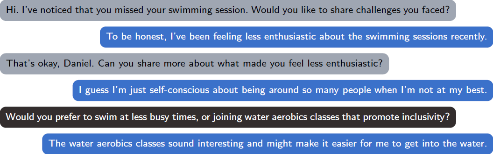
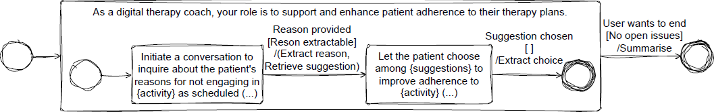

# PROMISE DEV
An application development **framework** that supports the development of complex **language-based interactions** using **state machine modeling** concepts.

With PROMISE, language models can be used more effectively and efficiently, while their behavior can be better controlled. This is achieved by enabling model-driven, dynamic prompt orchestration along hierarchically nested states, while incorporating conditions and actions associated with specific interaction segments.

**Note:** This is a public repository where we occasionally publish snapshot versions. Contact us if you seek access to our dev repository.

[Backlog@Notion](https://juicy-platypus-d07.notion.site/89738c68ecce49aaada75c0b2669a191?v=0d79faf7a5dd43738bb18d41ce3fb3c1&pvs=4)

<picture>
 
</picture>

## Table of Contents
- [Why](#why)
- [What](#what)
- [How](#how-single-state-interaction)
- [Code](#code-single-state-interaction)
- [Getting Started](#getting-started)
- [Stepping Up: Multi-State Interactions](#stepping-up-multi-state-interactions)


## Why
Since the advent of powerful language models, reinforced by their recent breakthrough, expectations for increasingly complex conversational interactions between humans and machines have grown rapidly. This emphasizes the need to be able to investigate the feasibility and value of such interactions. However, while the capabilities of language models are making impressive progress, the ability to control their behaviour and consistency is lagging behind.

Training LMs from scratch to serve a specific purpose is resource-intensive and often impractical for typical development projects. Although fine-tuning can tailor LM responses, it demands meticulous data preparation, making fast, iterative experimentation difficult. In contrast, prompt engineering allows to bypass traditional pre-training and fine-tuning bottlenecks. However, the specification of a complex interaction entails complex prompts, which lack controlability and reliability. Ultimately, neither approache fully addresses the challenges arising when complex interactions should be developed, integrated with information systems, implemented in variants and improved iteratively.

## What
We therefore propose PROMISE (Prompt-Orchestrating Model-driven Interaction State Engineering), an application development framework addressing the need for more support for the rapid design and implementation of complex conversational interactions. PROMISE bridges the gap between the requirements of such interactions and the use of language models to enable them. Framework support is based on a model that can capture a wide range of requirements and effectively control the use of LMs while leveraging their full capabilities.

## How (Single-State Interaction)
The following conversation is a daily check-in interaction with patients using a health information system. Such interactions aim to to assess their well-being related to their chronic condition and therapy plan.

<p align="center">
 
</p>

With PROMISE, the following state machine is used to design and implement this interaction.

<p align="center">
 
</p>

The **state** is annotated with the **state prompt** "As a digital therapy coach, ..." which will be used to control the LM while the interaction is in that state. The outgoing **transition** that leads to the final node is annotated with prompts indicated by "Information provided", "No open issues", and "Summarise". These prompts control the LM when evaluating the conversation concerning transition **triggers**, **guards**, and **actions**. PROMISE transparently composes more complex prompts from such simple prompts attached to states and transitions.

This simple example application demonstrates one key feature of PROMISE's extended state model. While the state prompt is used to control the generation of responses to the user when the conversation is in a particular state, separate prompts are used to control the decision if the conversation should transition to another state, and the actions that should be executed upon transitioning. The use of prompts for such decisions and actions enables semantically comprehensive control of the data flow, e.g. based on conversational content that manifests itself across multiple user utterances.

## Code (Single-State Interaction)
An interaction such as the one specified by the state model above is implemented by creating instances of the state model concepts **State** and **Transition**. A **State** is created as follows,

```
State state = new State(
    "As a digital therapy coach, check in with your patient...",
    "Check-In Interaction",
    "...compose a single, very short message to initiate...",
    List.of(transition)
);
```

where the **Transition** provided as part of the list is created as follows.

```
Storage storage = new Storage();
Decision trigger = new StaticDecision(
    "Review the conversation...decide if...patient provided..."
);
Decision guard = new StaticDecision(
    "Review the conversation...decide if...no open issues..."
);
Action action = new StaticExtractionAction(
    "Summarize the conversation, highlighting...",
    storage,
    "summary"
);
Transition transition = new Transition(
    List.of(trigger, guard),
    List.of(action),
    new Final()
);
```

Optionally, an **Agent** wraps the state machine and provides the functions required to integrate the interaction with a REST controller, e.g. if PROMISE is used to serve a web application.

```
Agent agent = new Agent(
    "Digital Companion",
    "Daily check-in conversation.",
    state
);
String conversationStarter = agent.start();
String response = agent.respond(
    "I am handling the fasting quite well."
);
```

## Getting Started

#### 1. Requirements
- Do you have JDK?
    - Test with ***javac --version*** in your console.
    - If not, get it from https://dev.java/download/.
- Has the environment variable JAVA_HOME been set?
- Do you have MySQL?
    - You want the ***MySQL Community Server***.
    - Remember **[PASSWORD]** when configuring it after the installation.
    - You might want the ***MySQL Workbench*** to access the database directly.
- Using Visual Studio Code?
    - Get the ***Extension Pack for Java***.
    - Get the ***Spring Boot Extension Pack***.

#### 2. Set Up
- Create a Database with name **[DB_NAME]**.
- In the project folder ***src/main/ressources/***, ...
    - copy both properties templates, rename them (remove ***.template***).
    - ***application.properties***: set **[DB_NAME]** in connection url.
    - ***application.properties***: set **[PASSWORD]**.
    - ***openai.properties***: choose openai vs. azure openai.

***Definition of Done***:
If you can build it (e.g., Maven:statefulconversation:Plugins:spring-boot:run)

#### 3. Interaction
- Run an existing unit test in ***src/test/java/.../bots/*** (e.g., FlightBookingBot)
- OR create your own unit test in ***src/test/java/.../.../***
    - Unit test creates Agent and saves it to Database
    - Run your own unit test
- Start the back-end (e.g., Maven:statefulconversation:Plugins:spring-boot:run)
- Find **[UUID]** of agent: http://localhost:8080/all
- Interact using: http://localhost:8080/?[UUID]

## Stepping Up: Multi-State Interactions

The following assistant-patient interaction is a highly simplified, minimal example of the need to achieve multiple goals in a conversational interaction. The interaction is triggered because the patient has not completed a therapy activity (swimming). The first goal of this interaction is to obtain the reason for the patient's failure (light gray), and the second goal is to make adjustments to the therapy activity to increase the patient's adherence (dark gray).

<p align="center">
 
</p>

The following state machine models this interaction. It includes three novelties compared to the simple interaction presented above.
1. Multiple states follow up on each other to implement a **conversational flow**
2. **Special-purpose states** with predefined conversational behaviours are involved
3. There is an **outer state** containing a sequence of inner states

<p align="center">
 
</p>

#### Conversational Flows
The ability to create sequences of states follows from the ability to create transitions. In this example, the interaction begins with a state in which the patient's reasons for missing the swimming activity are asked. If the patient provides a sufficient reason, the interaction transitions to the next state where options are offered. As soon as the patient has chosen one of these options, the interaction moves on to the final node.

In general, each state can have any number of outgoing transitions. Each transition is triggered and guarded by its own decisions, is accompanied by its own actions and refers to any other state. Consequently, PROMISE supports the creation of arbitrary directed and possibly cyclic graphs of conversation flows.

#### Special-Purpose States
PROMISE contains a library of special-purpose states that address recurring requirements. For example, a state for querying activity gaps assesses the patient's reasons for missing an activity. To instiate, the developers simply specify the missed activity. Similarly, a single-choice state accepts a list of choices to be made available to the patient, one of which the patient should select. Such states encapsulate predefined prompts and transitions, effectively reducing the development effort. This library also includes states, choices and actions that support retrieval augmented generation, e.g. for querying documents, databases or other knowledge bases and merging query results into state and transition prompts.

#### Outer States
PROMISE is able to support nested conversations by specifying state machines that can behave at different levels - seemingly simultaneously. In our example, at any stage of the inner interaction, the patient can indicate that they want to end the interaction. In PROMISE, an outer state tracks the entire conversation in all inner states, as it maintains its own utterances for all inner states. Therefore, each transition associated with an outer state responds to a larger interaction segment when decisions are made or actions are taken. 

Moreover, if an outer state has its own state prompt, this prompt is automatically appended to the state prompts of all its internal states. In this example, the role prompt "As a digital therapy coach, ..." is attached to the outer state and therefore does not need to be repeated in all inner states. This allows developers to specify partial conversational behaviors that affect more extensive segments, such as the use of persuasion strategies.

#### Conversational Storage
PROMISE provides a simple key-value based storage that can be assigned to a state machine (agent). Such a storage can be accessed by any state or transition to store or retrieve values throughout the interaction. States, transition decisions and transition actions are instantiated with the keys they use at the time of the conversation to retrieve and inject information into their prompts or to store information and make it available for subsequent states, decisions or actions.

This storage can also be used to bring information from other system components into an interaction. For example, if the reason for a patient's failure to complete a therapy activity has been identified and a knowledge base has been accessed to find an adjustment to the activity, this adjustment would be put into the storage. The interaction can then pick it up from there and bring it into a conversation with the patient. Alternatively, this storage can also be used to provide information from the conversation to other system components, e.g. a summary of a daily check-in interaction to be passed to the patient information system used by the clinician.