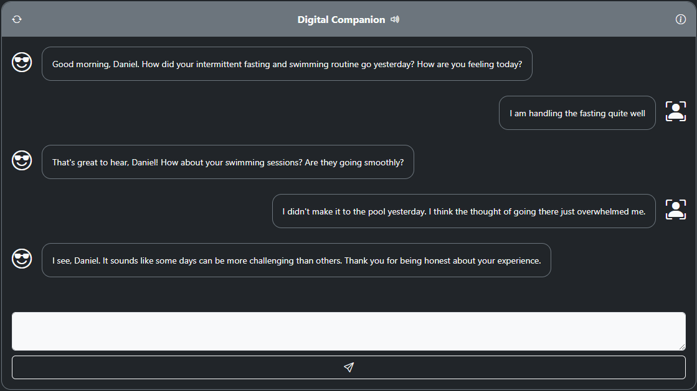
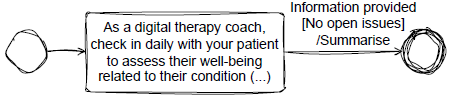

# PROMISE
An application development **framework** that supports the development of complex **language-based interactions** using **state machine modeling** concepts.

With PROMISE, language models can be used more effectively and efficiently, while their behavior can be better controlled. This is achieved by enabling model-driven, dynamic prompt orchestration along hierarchically nested states, while incorporating conditions and actions associated with specific interaction segments.

**Note:** This is a public repository where we occasionally publish snapshot versions. Contact us if you seek access to our dev repository.

<picture>
 
</picture>


## Table of Contents
- [Why](#why)
- [What](#what)
- [How](#how)
- [Code](#code)
- [Getting Started](#getting-started)


## Why
Since the advent of powerful language models, reinforced by their recent breakthrough, expectations for increasingly complex language-based interactions between humans and machines have grown rapidly. This emphasizes the need to be able to investigate the feasibility and value of such interactions. However, while the capabilities of language models are making impressive progress, the ability to control these models is lagging behind.

Training LMs from scratch to serve a specific purpose is resource-intensive and often impractical for typical development projects. Although fine-tuning can tailor LM responses, it demands meticulous data preparation, making fast, iterative experimentation difficult. In contrast, prompt engineering allows to bypass traditional pre-training and fine-tuning bottlenecks. However, the specification of a complex interaction entails complex prompts, which lack reliability. Ultimately, neither approache fully addresses the challenges arising when complex interactions should be designed, integrated with information systems, implemented in variants and improved iteratively.

## What
We therefore developed PROMISE (Prompt-Orchestrating Model-driven Interaction State Engineering), an application development framework addressing the need for more support for the rapid design and implementation of complex language-based interactions. PROMISE bridges the gap between the requirements of such interactions and the use of language models to enable them. Framework support is based on a model that can capture a wide range of requirements and effectively control the use of LMs while leveraging their full capabilities.

## How
The following conversation is a daily check-in interaction with patients using a health information system. Such interactions aim to to assess their well-being related to their chronic condition and therapy plan.

<p align="center">
 
</p>

With PROMISE, the following state machine is used to design and implement this interaction.

<p align="center">
 
</p>

The **state** is annotated with the **state prompt** "As a digital therapy coach, ..." which will be used to control the LM while the interaction is in that state. The outgoing **transition** that leads to the final node is annotated with prompts indicated by "Information provided", "No open issues", and "Summarise". These prompts control the LM when evaluating the conversation concerning transition **triggers**, **guards**, and **actions**. PROMISE transparently composes more complex prompts from such simple prompts attached to states and transitions.

## Code
An interaction such as the one specified by the state model above is implemented by creating instances of the state model concepts **State** and **Transition**. A **State** is created as follows,

```
State state = new State(
    "As a digital therapy coach, check in with your patient...",
    "Check-In Interaction",
    "...compose a single, very short message to initiate...",
    List.of(transition)
);
```

where the **Transition** provided as part of the list is created as follows.

```
Storage storage = new Storage();
Decision trigger = new StaticDecision(
    "Review the conversation...decide if...patient provided..."
);
Decision guard = new StaticDecision(
    "Review the conversation...decide if...no open issues..."
);
Action action = new StaticExtractionAction(
    "Summarize the conversation, highlighting...",
    storage,
    "summary"
);
Transition transition = new Transition(
    List.of(trigger, guard),
    List.of(action),
    new Final()
);
```

Finally, an **Agent** wraps the state machine and provides the functionality required when integrating the interaction with an information system, as exemplified by the following lines of code.

```
Agent agent = new Agent(
    "Digital Companion",
    "Daily check-in conversation.",
    state
);
String conversationStarter = agent.start();
String response = agent.respond(
    "I am handling the fasting quite well."
);
```

## Getting Started

#### 1. Requirements
- Do you have JDK?
    - Test with ***javac --version*** in your console.
    - If not, get it from https://dev.java/download/.
- Has the environment variable JAVA_HOME been set?
- Do you have MySQL?
    - You want the ***MySQL Community Server***.
    - Remember **[PASSWORD]** when configuring it after the installation.
    - You might want the ***MySQL Workbench*** to access the database directly.
- Using Visual Studio Code?
    - Get the ***Extension Pack for Java***.
    - Get the ***Spring Boot Extension Pack***.

#### 2. Set Up
- Create a Database with name **[DB_NAME]**.
- In the project folder ***src/main/ressources/***, ...
    - copy both properties templates, rename them (remove ***.template***).
    - ***application.properties***: set **[DB_NAME]** in connection url.
    - ***application.properties***: set **[PASSWORD]**.
    - ***openai.properties***: set openai api key and optionally choose gpt model.

***Definition of Done***:
If you can build it (e.g., Maven:statefulconversation:Plugins:spring-boot:run)

#### 3. Interaction
- Run an existing unit test in ***src/test/java/.../bots/*** (e.g., FlightBookingBot)
- OR create your own unit test in ***src/test/java/.../.../***
    - Unit test creates Agent and saves it to Database
    - Run your own unit test
- Start the back-end (e.g., Maven:statefulconversation:Plugins:spring-boot:run)
- Find **[UUID]** of agent: http://localhost:8080/all
- Interact using: http://localhost:8080/?[UUID]
