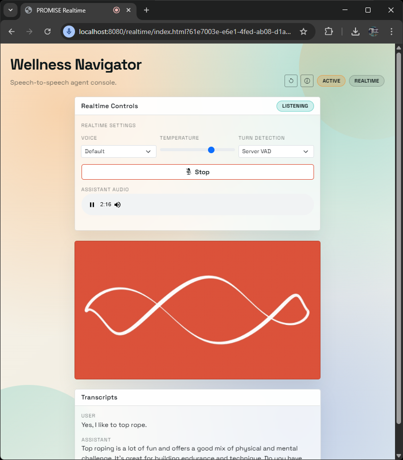

# PROMISE Realtime Integration

This document describes the new Realtime-focused functionality added on top of PROMISE. It assumes you already read README.md and want only what changed and how to use it.

## Table of Contents
- [PROMISE Realtime Integration](#promise-realtime-integration)
  - [Table of Contents](#table-of-contents)
  - [What This Adds](#what-this-adds)
  - [Clients](#clients)
    - [Realtime](#realtime)
    - [Monitor](#monitor)
    - [Python](#python)
  - [Conceptual Model](#conceptual-model)
  - [What You Can Now Support](#what-you-can-now-support)
  - [Implementation Overview](#implementation-overview)
    - [New API Endpoints](#new-api-endpoints)
    - [New Clients](#new-clients)
    - [Realtime Session Creation](#realtime-session-creation)
    - [Logging to the Browser](#logging-to-the-browser)
    - [State Listing](#state-listing)
  - [Setup and Getting Started](#setup-and-getting-started)
  - [Developer Options](#developer-options)
    - [Turn Boundary](#turn-boundary)
    - [Prompt Update Strategy](#prompt-update-strategy)
    - [Assistant Transcript Handling](#assistant-transcript-handling)
    - [Response Trigger Strategy](#response-trigger-strategy)
  - [Notes and Constraints](#notes-and-constraints)

## What This Adds
- A prompt-orchestration flow that bypasses LLM response generation inside PROMISE.
- Browser-based Realtime client that streams audio to OpenAI and uses PROMISE to manage state, prompts, and history.
- Server-side streaming of PROMISE logs to the browser via SSE.
- Minimal state visualization (all states + current state) for a running agent.
- Separate monitoring page for logs + state tracking.
- Ephemeral Realtime session creation endpoint to support direct browser access to OpenAI with low latency.

## Clients

### Realtime
- URL: `http://localhost:8080/realtime/?<agentUUID>`
- Or: `http://localhost:8080/realtime/?agentId=<agentUUID>`
- Voice-first, low-latency client that streams audio and uses PROMISE for orchestration.

 

### Monitor
- URL: `http://localhost:8080/monitor/?<agentUUID>`
- Or: `http://localhost:8080/monitor/?agentId=<agentUUID>`
- Live state display (current state + all states) and PROMISE processing logs.

 

### Python
For Python usage, see `PROMISE_Realtime.ipynb`.

## Conceptual Model
PROMISE still owns the state machine, transitions, decisions, actions, storage, and conversation history. The difference is:
- PROMISE no longer generates assistant responses for the user.
- PROMISE assembles the prompt bundle that should be used by the Realtime model to respond.
- OpenAI Realtime produces audio output and transcripts.
- Those transcripts are fed back into PROMISE so transitions and actions can be evaluated.

This design keeps PROMISE as the orchestration engine and lets Realtime handle speech-to-speech interaction with minimal latency.

## What You Can Now Support
- Speech-to-speech agents via OpenAI Realtime.
- Prompt updates driven by PROMISE prompt bundles.
- PROMISE transition decisions and actions executed using transcript-based input.
- Live PROMISE logs and state information in the browser.

## Implementation Overview

### New API Endpoints
- `GET /{agentID}/prompt`
  - Returns the current prompt bundle (system prompt + starter prompt) without calling the LLM.
- `POST /{agentID}/acknowledge`
  - Appends a user transcript to PROMISE history and evaluates transitions/actions.
- `POST /{agentID}/assistant`
  - Appends assistant transcript text to PROMISE history.
- `GET /{agentID}/state`
  - Returns the current state name.
- `GET /{agentID}/states`
  - Returns a list of all states reachable from the agent's initial state.
- `POST /realtime/session`
  - Creates an OpenAI Realtime session and returns an ephemeral client secret.
- `GET /logs/stream`
  - Server-Sent Events stream for PROMISE logs.

### New Clients
- `src/main/resources/public/realtime/index.html`
- `src/main/resources/public/realtime/script.js`
- `src/main/resources/public/monitor/index.html`
- `src/main/resources/public/monitor/script.js`

The Realtime client:
- Starts/stops microphone capture with a single button.
- Establishes a Realtime WebRTC session directly with OpenAI.
- Updates Realtime session instructions when PROMISE prompt bundles change.
- Sends completed user transcripts to PROMISE (`/acknowledge`) and then fetches `/prompt`.
- Sends assistant transcripts back to PROMISE (`/assistant`).

The Monitor client:
- Shows PROMISE logs via SSE.
- Shows the current state + list of states.

### Realtime Session Creation
The backend creates an ephemeral client secret for Realtime and returns:
- `clientSecret` used as bearer token in the browser
- `model` for the Realtime session
- `realtimeUrl` for the WebRTC SDP exchange

This keeps long-lived OpenAI API keys on the server.

### Logging to the Browser
PROMISE logs are published via SSE:
- Logback appender emits log events into a broadcaster.
- Browser subscribes to `/logs/stream` and renders a live log panel.

### State Listing
PROMISE now traverses the state graph from the initial state to list all states, including nested states from an OuterState.

## Setup and Getting Started

1) Configure OpenAI properties
   - Update `src/main/resources/openai.properties` (or `openai-prod.properties`):
     - `openai.key` (standard API key)
     - `openai.realtimeModel` (default: `gpt-4o-realtime-preview-2024-12-17`)
     - `openai.realtimeSessionUrl` (default: `https://api.openai.com/v1/realtime/sessions`)
     - `openai.realtimeUrl` (default: `https://api.openai.com/v1/realtime`)
   - Realtime session creation is currently OpenAI-only (not Azure).

2) Run PROMISE
   - Start the Spring Boot app as usual.

3) Create or pick an agent
   - Use existing agent setup flow from README.md.
   - Get the agent UUID from `/agent`.

4) Open the Realtime client
   - Navigate to:
     - `http://localhost:8080/realtime/?<agentUUID>`
     - or `http://localhost:8080/realtime/?agentId=<agentUUID>`

5) Open the Monitor client (optional)
   - Navigate to:
     - `http://localhost:8080/monitor/?<agentUUID>`
     - or `http://localhost:8080/monitor/?agentId=<agentUUID>`

6) Start listening
   - Click "Start Listening".
   - Speak and watch:
     - transcripts update
     - PROMISE logs stream in (monitor page)
     - state updates as transitions occur (monitor page)

## Developer Options

### Turn Boundary
Current implementation triggers PROMISE evaluation on:
- `conversation.item.input_audio_transcription.completed`

You can switch to:
- VAD-based boundaries
- explicit push-to-talk boundaries
- alternative transcript signals

### Prompt Update Strategy
Currently, session instructions update every time the client fetches the prompt bundle.
You can switch to:
- update only when the PROMISE state changes
- update on specific transitions only

### Assistant Transcript Handling
Assistant transcripts are appended to PROMISE history via `/assistant`.
If you want different behavior:
- store only summaries
- filter or redact parts before storing

### Response Trigger Strategy
The client currently triggers the initial response using the starter prompt only.
You can switch to:
- explicit `response.create` for every turn
- allow Realtime auto-response based on updated session instructions

## Notes and Constraints
- Input audio transcription is asynchronous and should be treated as guidance, not verbatim text.
- PROMISE decisions should be robust to transcription variance.
- Realtime session creation is implemented for OpenAI, not Azure OpenAI.
